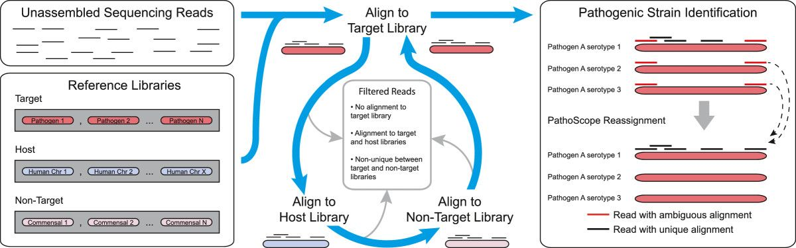
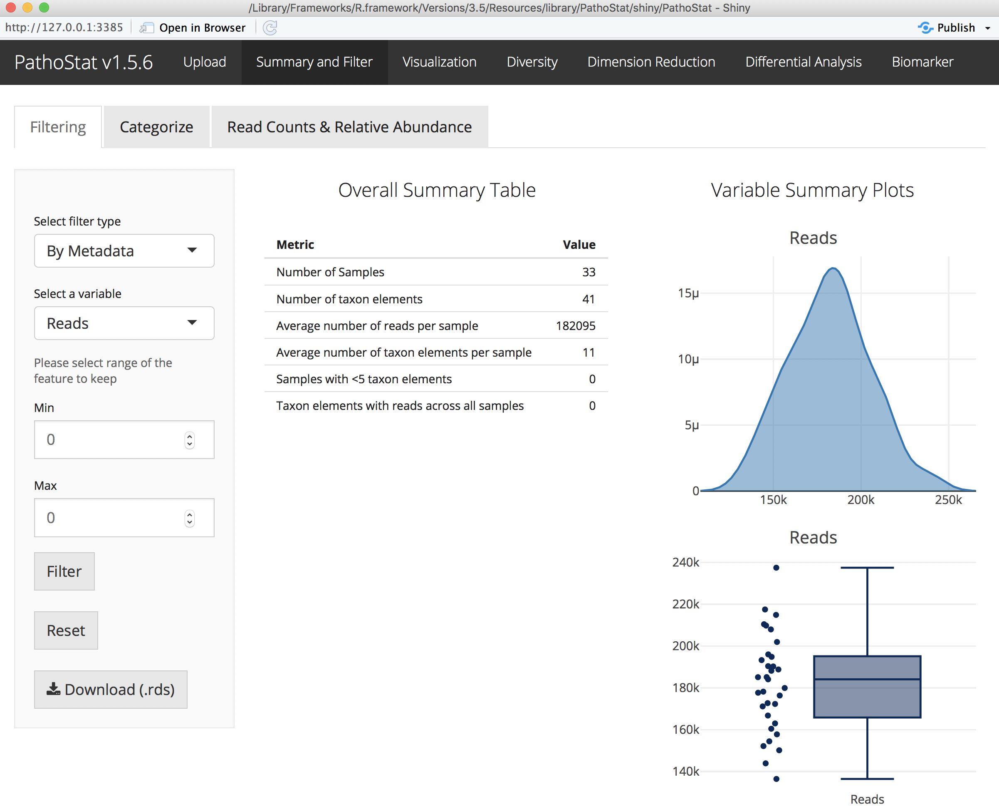
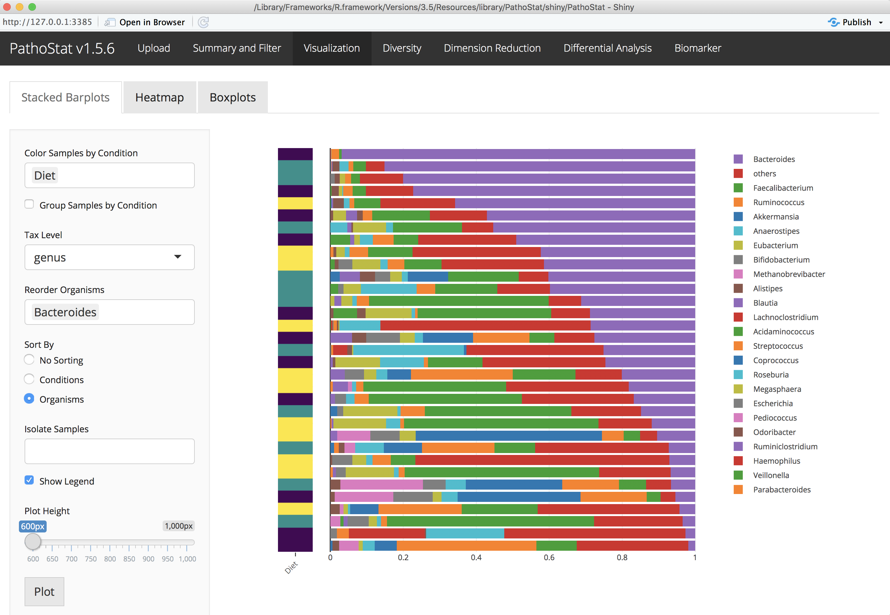

## Introduction to the terminal {.tabset}
Understanding how to use the terminal is a crucial skill needed for conducting bioinformatics analyses. Many programs are newly developed by sciencists, not programmers, 

### Basic unix commands
```{r engine='bash', eval=FALSE}
pwd
cd ~/Desktop/microbiome_tutorial/
ls
cd fastq_data
ls
cd ..
cp combined.fasta combined2.fasta
mv  combined2.fasta genome/
cd genome
rm combined2.fasta
less combined.fasta #tab completion
less -S combined.fasta #tab completion
```

### Get started
```{r engine='bash', eval=FALSE}
# Make a new directory with your name
cd ~/Desktop/microbiome_tutorial/
mkdir results
```


## Read quality control and trimming {.tabset}
### FASTQC example
```{r engine='bash', eval=FALSE}
## Run a single files
./software/FastQC/fastqc fastq_data/SRR1204622.trim.fastq.gz

## Run all the files
./software/FastQC/fastqc fastq_data/SRR*.trim.fastq.gz
```

###
### Trimmomatic example
```{r engine='bash', eval=FALSE}
java -jar software/Trimmomatic-0.36/trimmomatic-0.36.jar SE -phred33 fastq_data/SRR1204622.fastq fastq_data/SRR1204622.trim.fastq SLIDINGWINDOW:4:20 LEADING:3 TRAILING:3
```

## Downloading a reference genome library in R {.tabset}
Using the 'biomartr' package from Bioconductor

### Installation
```{r, eval=FALSE}
source("https://bioconductor.org/biocLite.R")
biocLite("biomartr")
```

### Individual genome {.tabset}
#### Human
```{r, eval=FALSE}
library(biomartr)
getGenome( db = "refseq", organism = "Homo sapiens", path = "~/Desktop/microbiome_tutorial/genome/fasta/")
```

#### MTB
```{r, eval=FALSE}
library(biomartr)
getGenome( db = "refseq", organism = "Mycobacterium tuberculosis", path = "~/Desktop/microbiome_tutorial/genome/fasta/")

## or all data for MTB:
getCollection( db = "refseq", organism = "Mycobacterium tuberculosis", reference=FALSE, path = "~/Desktop/microbiome_tutorial/genome/fasta/")
```

### Multiple genomes {.tabset}
#### All Actinobacteria
```{r, eval=FALSE}
library(biomartr)
getGroups(db = "refseq",kingdom='bacteria')
listGenomes(db = "refseq", type = "subgroup", subset = "Actinobacteria", details = FALSE)
meta.retrieval(db = "refseq", 'bacteria', group = "Actinobacteria", type = "genome",path = "~/Desktop/microbiome_tutorial/genome/fasta/")
```

#### Selected subset
```{r, eval=FALSE}
library(biomartr)
genomes = c("Mycobacterium tuberculosis",
"Staphylococcus aureus",
"Staphylococcus haemolyticus",
"Vibrio furnissii",
"Escherichia coli",
"Streptococcus pneumoniae",
"Haemophilus influenzae",
"Serratia proteamaculans",
"Lactobacillus delbrueckii",
"Lactococcus lactis",
"Streptococcus mitis",
"Porphyromonas gingivalis",
"Fusobacterium nucleatum",
"Stenotrophomonas maltophilia",
"Streptococcus thermophilus",
"Rothia mucilaginosa",
"Streptococcus gordonii",
"Finegoldia magna",
"Filifactor alocis",
"Streptococcus intermedius",
"Neisseria meningitidis",
"Staphylococcus epidermidis",
"Prevotella melaninogenica",
"Corynebacterium glutamicum",
"Atopobium parvulum",
"Veillonella parvula",
"Treponema denticola",
"Streptococcus salivarius",
"Cutibacterium acnes",
"Prevotella intermedia",
"Campylobacter concisus",
"Haemophilus parainfluenzae",
"Lactobacillus salivarius",
"Enterobacter lignolyticus",
"Streptococcus sanguinis",
"Selenomonas sputigena",
"Enterococcus faecalis")

library(Biostrings)
combined_ref=NULL
for (i in genomes){
  file_name = getGenome( db = "refseq", organism = i, reference=FALSE, path = "~/Desktop/microbiome_tutorial/genome/fasta/")
  combined_ref = append(combined_ref,readDNAStringSet(file_name))
}

writeXStringSet(combined_ref, "~/Desktop/microbiome_tutorial/genome/bacterial_ref.fasta")
```

### Entire kingdom {.tabset}
#### All viruses
```{r, eval=FALSE}
library(biomartr)
meta.retrieval(kingdom = "viral", db = "refseq", type = "genome", reference = TRUE, path = "~/Desktop/microbiome_tutorial/genome/fasta/")
```

#### All bacteria
```{r, eval=FALSE}
library(biomartr)
meta.retrieval(kingdom = "bacteria", db = "refseq", type = "genome",reference = FALSE, path = "~/Desktop/microbiome_tutorial/genome/fasta/")
```

## Running PathoScope
Here is a detailed look at the PathoScope workflow:


####Set up a Unix/Mac shortcut for Pathoscope
```{r engine='bash', eval=FALSE}
# make an alias for Pathoscope
alias pathoscope="~/Desktop/microbiome_tutorial/software/pathoscope2/pathoscope/pathoscope.py"

# start in the tutorial directory
cd ~/Desktop/microbiome_tutorial/
```

## Aligning to the reference genome with PathoMAP {.tabset}
USAGE: pathoscope MAP -U $readfile -indexDir $indDir -targetRefFiles $index_fna -expTag $sample -outDir $outDir -btHome $bthome

Here is the PathoMAP workflow:


### PathoScope reference genome format
```{r engine='bash', eval=FALSE}
less -S genome/combined.fasta
less -S genome/combined_pathoscope.fasta
```

### Format for PathoMAP
```{r, eval=FALSE}
library(Biostrings)
## Function to format genome libraries for PathoScope
format_pathoscope=function(ref_lib){
  ref = readDNAStringSet(ref_lib)
  accession=NULL; fullname=NULL; taxid=NULL
  for (i in strsplit(names(ref),' ')){
    accession=c(accession,i[1])
    fullname=c(fullname,paste(i[-1],collapse='_'))
    if(paste("doc_",i[2],"_",i[3],"_db_refseq.tsv",sep='') %in% allfiles){taxid=c(taxid,read.table(paste("doc_",i[2],"_",i[3],"_db_refseq.tsv",sep=''),header=T,sep="\t")$taxid)}else{taxid=c(taxid,99999)}
  }
  names(ref)=paste("ti|",taxid,"|accession|",accession,"|org|",fullname,sep='')
  writeXStringSet(ref, paste("pathoscope_",ref_lib,sep=''))
}

#setwd("~/Desktop/microbiome_tutorial/genome_test/")
#format_pathoscope("fasta/Staphylococcus_epidermidis_genomic_refseq.fna")
#format_pathoscope("combined.fasta")
```


### Aligning to bacterial genomes
```{r engine='bash', eval=FALSE}
pathoscope MAP --help

bthome=~/Desktop/microbiome_tutorial/software/bowtie2-2.1.0  # bowtie2 home directory
outDir=~/Desktop/microbiome_tutorial/results # set output to your home directory
sample=sample_628 # name the sample
reads=~/Desktop/microbiome_tutorial/fastq_data/SRR1204622.trim.fastq.gz  # read file
indDir=~/Desktop/microbiome_tutorial/genome/bowtie_bacteria_small # reference library location
index_fna=~/Desktop/microbiome_tutorial/genome/bowtie_bacteria_small/combined_pathoscope.fasta # reference fasta location

echo $bthome # print variables
echo $reads
less -S $reads

# Run PathoMap: small index
pathoscope MAP -U $reads -indexDir $indDir -targetRefFiles $index_fna -expTag $sample -outDir $outDir -btHome $bthome

# Output in .sam file
less -S evan/outalign.sam
```

## Removing ambiguity with PathoID {.tabset}
USAGE: pathoscope ID -alignFile $outalign.sam -outDir $outDir -expTag $sample  

We use a Bayesian mixture modeling approach to remove abiguity in read mapping:



#### Estimating the proportions of reads to each bacteria
```{r engine='bash', eval=FALSE}
pathoscope ID --help

outDir=~/Desktop/microbiome_tutorial/results # set output to your home directory
sample=sample_628 # name the sample

# Run PathoID to simmarize sam file 
pathoscope ID -alignFile $outDir/outalign.sam -outDir $outDir -expTag $sample --noUpdatedAlignFile 
```

## Running Pathoscope on a cluster
####Running multiple jobs on SCC (batch)
```{r engine='bash', eval=FALSE}
#!/bin/bash -l

# Set SCC project
#$ -P johnsonlab

# Specify hard time limit for the job. 
#   The job will be aborted if it runs longer than this time.
#   The default time is 12 hours
#$ -l h_rt=12:00:00

# Send an email when the job finishes or if it is aborted (by default no email is sent).
#$ -m ae

# Give job a name
#$ -N TB_biomarker

# Request eight cores
#$ -pe omp 8

# Combine output and error files into a single file
#$ -j y

# Specify the output file name
#$ -o TB_biomarker.qlog

# Submit an array job with n tasks
#$ -t 1-60

# Use the SGE_TASK_ID environment variable to select the appropriate input file from bash array
# Bash array index starts from 0, so we need to subtract one from SGE_TASK_ID value
inputs=(*_tmp"/")
index=$(($SGE_TASK_ID-1))
taskinput=${inputs[$index]}

# Keep track of information related to the current job
echo "=========================================================="
echo "Start date : $(date)"
echo "Job name : $JOB_NAME"
echo "Job ID : $SGE_TASK_ID"
echo "=========================================================="

module load bowtie2/2.3.2
module load python/2.7.13
pathoscope="/restricted/projectnb/pathoscope/code/PathoScope/pathoscope/pathoscope2.py"

dataDir=$taskinput
reads1=$dataDir*.fastq
eTag=${taskinput:0:10} 
indDir="/restricted/projectnb/pathoscope/reflib/index"
targLibs="bacteria_ti_0,bacteria_ti_1,fungi_nt_ti"

$pathoscope MAP -U $reads1 -indexDir $indDir -targetIndexPrefixes $targLibs -expTag $eTag -outDir $dataDir

rm $dataDir$eTag*.sam

$pathoscope ID -expTag $eTag -alignFile $dataDir"outalign.sam" --noUpdatedAlignFile -outDir $dataDir
```

## PathoStat analysis and visualization {.tabset}
Screenshot examples of PathoStat:



### View PathoScope results
```{r engine='bash', eval=FALSE}
outDir=~/Desktop/microbiome_tutorial/results # set output to your home directory

cd $outDir 

less -S $outDir/sample_628-sam-report.tsv
```

### Install PathoStat
```{r, eval=FALSE}
### Bioconductor version
source("https://bioconductor.org/biocLite.R")
biocLite("PathoStat")

### For the latest updates (USE THIS ONE!)
devtools::install_github("compbiomed/PathoStat")
```


### Run PathoStat interactively
```{r, eval=FALSE}
library(PathoStat)
runPathoStat()
```
##

